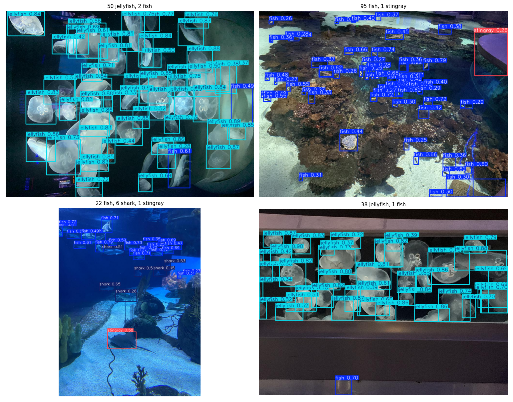
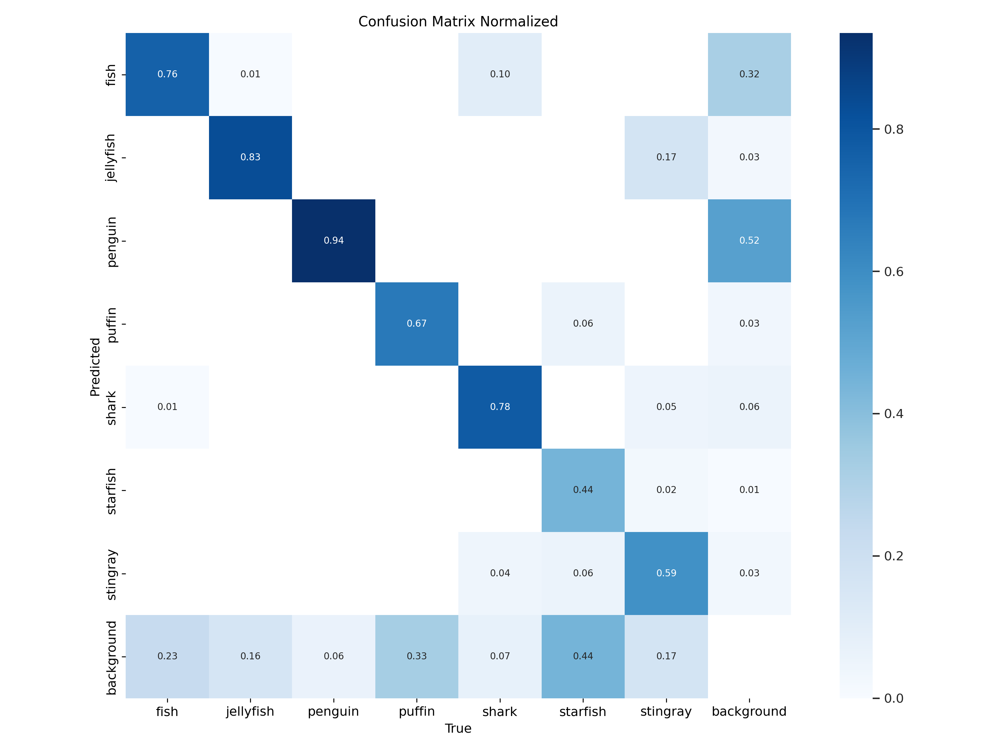
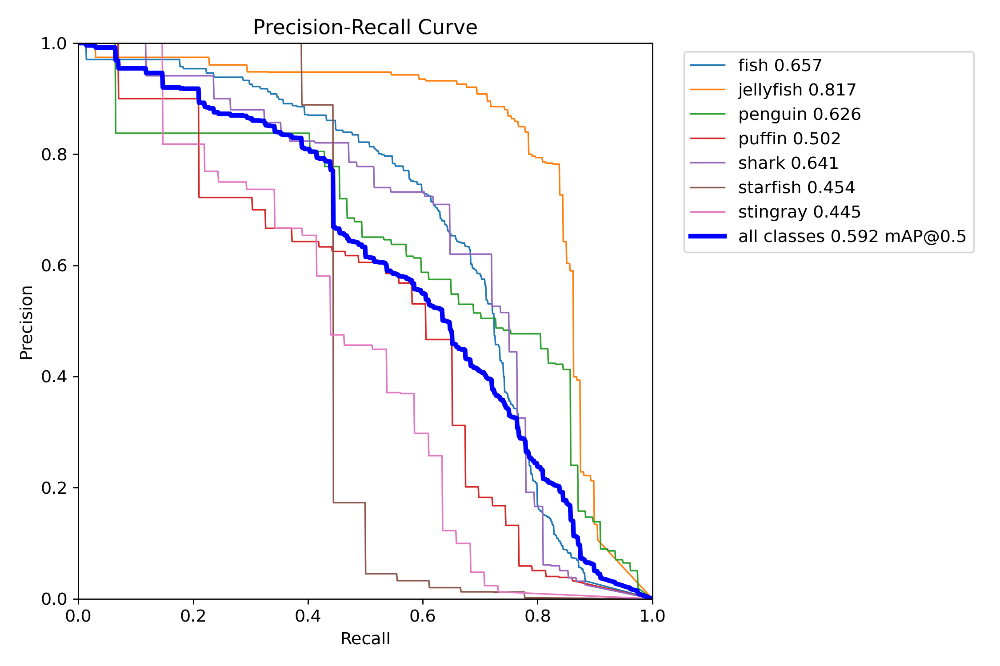
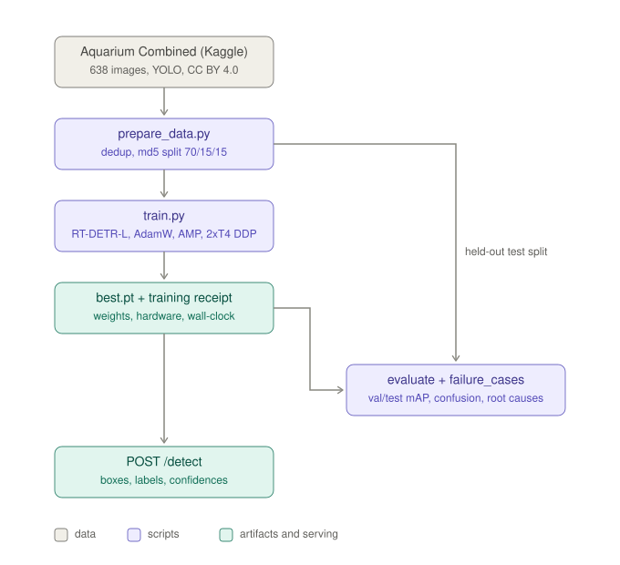
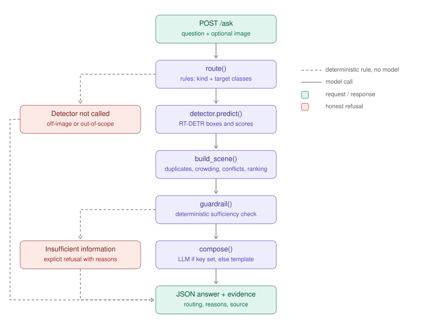
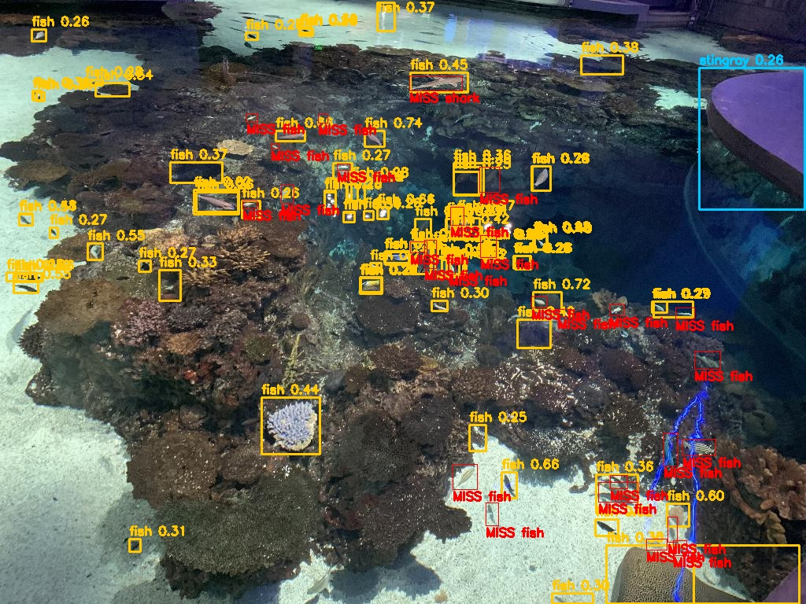

# Aquarium Animal Census API

[](Dockerfile)
[](https://github.com/KanagavelAK/aquarium-rtdetr/releases/download/v1.0/best.pt)
[](memo/MEMO.pdf)


RT-DETR-L fine-tuned to find seven kinds of animal in public-aquarium
photographs — **fish, jellyfish, penguin, puffin, shark, starfish, stingray**
(none of them a COCO class) — exposed through a FastAPI service, with a
hand-written reasoning layer that answers census questions (*how many sharks*,
*what is the most common animal*, *are there more fish than jellyfish*) from
the detections and **refuses when schooling, label conflicts or weak boxes
make the answer unreliable**.

Built for the RAP pre-hackathon screening task "Constrained Object Detection &
Reasoning API".

| | |
|---|---|
| **Run the API** | `uvicorn app.main:app --port 8000` or `docker run -p 8000:8000 aquarium-rtdetr` — `/detect`, `/ask`, `/health`, Swagger at `/docs`; demo page with `python space_app.py` |
| **Weights** | [best.pt (GitHub release v1.0)](https://github.com/KanagavelAK/aquarium-rtdetr/releases/download/v1.0/best.pt) — downloaded automatically on first start |
| **Memo** | [memo/MEMO.pdf](memo/MEMO.pdf) (2 pages) — dataset, split, metrics, five failure cases, reasoning layer |
| **Training notebook** | [notebooks/kaggle_aquarium_rtdetr.ipynb](notebooks/kaggle_aquarium_rtdetr.ipynb) — one Save & Run All reproduces everything |
| **Metrics and receipts** | [artifacts/](artifacts/) — `metrics.json`, `training_receipt.json`, `split_stats.json`, `failures/` |



*Model output on four held-out test images (busiest scenes first).*

## Results

Held-out test split (98 images, 787 boxes), never seen during training or
model selection; validation (93 images) was used to pick `best.pt`:

| class | val mAP50 | test mAP50 | test mAP50-95 | test precision | test recall |
|---|---|---|---|---|---|
| fish | 0.672 | 0.657 | 0.354 | 0.611 | 0.684 |
| jellyfish | 0.886 | 0.817 | 0.493 | 0.794 | 0.808 |
| penguin | 0.503 | 0.626 | 0.235 | 0.611 | 0.584 |
| puffin | 0.460 | 0.502 | 0.225 | 0.489 | 0.605 |
| shark | 0.597 | 0.641 | 0.329 | 0.610 | 0.689 |
| starfish | 0.667 | 0.454 | 0.338 | 0.884 | 0.425 |
| stingray | 0.451 | 0.445 | 0.287 | 0.449 | 0.463 |
| **all** | **0.605** | **0.592** | **0.323** | **0.635** | **0.608** |

**What the numbers mean.** Val and test agree to 0.014 mAP50, so model
selection did not overfit the validation split and the md5 split is clean.
Jellyfish is the strong class (own tanks, distinctive shape); starfish is
precise but blind (P 0.88, R 0.43: found 8 of 18) because it is 2.4 % of the
training boxes; stingray is the weakest, and six of its 41 test boxes are
predicted *jellyfish* — the dataset's one documented label error (seven
jellyfish annotated as stingray) most likely sits in this split, see the
memo. The confusion matrix as numbers is in `artifacts/metrics.json`
(`test.confusion`). The model is **under-trained**: validation mAP50 was
0.13 at epoch 40, 0.46 at 60, 0.54 at 70 and 0.61 at 80, still rising when
the budget ended. The reviewer's hidden set is a different aquarium; treat
these numbers as an upper bound for it.

**Performance.** RT-DETR-L, 32 M parameters, 105 GFLOPs at 640 px, weights
66 MB. Inference per image: 39 ms on a T4 GPU (Ultralytics val, batch 16); about
2 s on the Space's shared CPU, 0.6 s on a laptop CPU. Requests are serialised behind a lock (the
Ultralytics predictor is not re-entrant).

<p align="center">


</p>

## Architecture

<p align="center">


</p>

**Part A — detection.** `prepare_data.py` walks the download, drops
byte-identical duplicates, maps class ids to the fixed order by name and
re-splits with `md5(file stem)` (70/15/15, image level). `train.py` fine-tunes
COCO-pretrained `rtdetr-l.pt` with Ultralytics 8.3.40 on 2 × T4 (DDP,
AdamW, AMP). `evaluate.py` reports val and test, per class, with the confusion
matrix as numbers. `failure_cases.py` mines the test split for the worst
images and measures blur, contrast, scale, crowding and exposure on every
miss. `app/detector.py` loads the checkpoint once and returns plain
dictionaries.

**Part B — reasoning.** `POST /ask` runs four steps, in this order, all in
`app/reasoning.py` and `app/scene.py`:

1. **Route.** Deterministic rules over a closed vocabulary sort the question
   into one of eight kinds — `count`, `count_kinds`, `ranking` (most/least
   common), `comparison`, `presence`, `summary`, `not_about_the_image`,
   `out_of_detector_scope` — and extract which classes it names (synonyms
   included: *sea star* → starfish, *rays* → stingray, and *jellyfish* never
   counts as *fish*). The last two kinds skip the detector: a question that
   is not about the image (*capital of France*), and one that is about the
   image but asks for what the detector cannot measure (*what species of
   shark*, *is the penguin healthy*, *how big is the stingray*, *any baby
   penguins*, *how many people*). Rules are faster than a model call and
   cannot hallucinate a route.
2. **Detect.** The Part A model runs once.
3. **Census facts** (`build_scene`). Same-class boxes with IoU ≥ 0.70 are
   collapsed to the stronger one (RT-DETR has no NMS; a second query on the
   same animal must not count twice). Each class then gets a count, how many
   boxes clear the 0.45 assertion floor, a **crowding** score (fraction of
   its boxes overlapping another box of the same class by IoU ≥ 0.30) and a
   list of **identity conflicts** (boxes of a different class on the same
   pixels, IoU ≥ 0.50). Classes are ranked by count.
4. **Guardrail, then compose.** Before any language model is involved, rules
   decide whether the facts support the question: no detections or every
   box below 0.45 → refuse; a count is refused when crowding exceeds 34 %,
   when fewer than half the boxes clear the floor, or when the class is in a
   label conflict; a ranking is refused when the top two counts are within
   15 % (or one box) of each other; presence is refused when the only
   evidence is below the floor. Only after the guard passes does one direct
   Anthropic Messages API call phrase the facts; with no key, templates
   phrase the same facts and `answer_source` says which.

Every response carries `routing`, `detector_called`, `guardrail_reasons` and
the full `evidence`, so a refusal is auditable.

## Failure analysis

`scripts/failure_cases.py` ranks test images by error count and measures
each miss (blur, contrast, scale, crowding, exposure) and each false
positive (duplicate query or not). 90 of 98 test images have at least one
error; the eight worst, annotated, are in `artifacts/failures/` with
`failure_report.json`. The memo discusses five:

1. **Distant penguin row** (`IMG_2306`): 12 labelled penguins on a ledge
   ~15 px tall at 640; the model emits **149 penguin boxes, 147 of them
   below 0.45 and 62 duplicates** of each other. Scale-driven query spray,
   not hallucination — and the reason the assertion floor is 0.45.
2. **Reef from above** (`IMG_8421`): 26 fish missed, median 0.05 % of the
   image (about 14 px), sharp (Laplacian var > 1,500), no occlusion. Pure
   scale. Same image: a shark at 0.16 % of the image called *fish* (0.45),
   a blue coral called *fish* (0.44), a table edge called *stingray* (0.26).
3. **Night tank** (`IMG_8509`): 46 "false positive" fish are real,
   unlabelled fish — annotators boxed only the four sharks. The metric
   penalises the model for seeing what the labels skipped.
4. **Stingray → jellyfish** (6 of 41 test stingrays): matches the dataset's
   one documented mislabelled image (seven jellyfish annotated as stingray).
   A label error the model got right; labels kept as published.
5. **Starfish recall 0.43 at precision 0.88**: 116 training boxes (2.4 %),
   and the training curve had not converged. Class imbalance plus budget.

<p align="center"></p>

*Case 2: yellow = predictions, red = missed ground truth. The misses are
the tiny reef fish; the extra yellow boxes at the top are surface glare.*

## Quickstart

Python 3.10 to 3.13. No GPU needed to serve.

```bash
git clone https://github.com/KanagavelAK/aquarium-rtdetr
cd aquarium-rtdetr
pip install -r requirements.txt
uvicorn app.main:app --host 0.0.0.0 --port 8000
```

On first start the API downloads `best.pt` from the GitHub release into
`artifacts/`. Swagger UI is at http://localhost:8000/docs.

Tests (no GPU or checkpoint needed): `python -m pytest tests -q` — 20 tests
covering routing, duplicate suppression, crowding, conflicts and the guardrail.

Local demo page (Gradio + API in one process): `python space_app.py` →
http://localhost:7860.

### Configuration

All settings are environment variables; `.env.example` lists them with
defaults, and `uvicorn` picks up a `.env` automatically.

| Variable | Default | Meaning |
|---|---|---|
| `MODEL_WEIGHTS` | `artifacts/best.pt` | checkpoint path |
| `WEIGHTS_URL` | GitHub release v1.0 | where to fetch the checkpoint if the file is missing |
| `WEIGHTS_KAGGLE_DATASET` | empty | optional alternative source, `owner/slug` of a Kaggle dataset |
| `CONF_THRESHOLD` | `0.25` | default detection confidence cut-off (per-request override: form field `confidence`) |
| `IMGSZ` | `640` | inference size; must match training |
| `DETECTOR_DEVICE` | empty | empty lets Ultralytics choose; `cpu` pins inference to CPU |
| `LOW_CONFIDENCE_FLOOR` | `0.45` | guardrail: below this no assertion is made |
| `CROWDING_MAX` | `0.34` | guardrail: a count is refused above this crowding fraction |
| `CONFIDENT_FRACTION_MIN` | `0.5` | guardrail: a count needs this fraction of boxes above the floor |
| `RANK_MARGIN_FRACTION` | `0.15` | guardrail: a ranking needs the top two counts this far apart |
| `ANTHROPIC_API_KEY` | unset | optional; enables the language-model phrasing step |
| `ANTHROPIC_MODEL` | `claude-opus-5` | model for that single call |
| `MAX_UPLOAD_BYTES` | `12582912` | 12 MB upload limit; larger files get a 400 |
| `LOG_LEVEL` | `INFO` | one line per request with method, path, status, latency, request id |

## API

### `GET /health`

```json
{"status": "ok", "model_loaded": true, "weights": "artifacts/best.pt",
 "classes": ["fish", "jellyfish", "penguin", "puffin", "shark", "starfish", "stingray"],
 "llm_enabled": false}
```

### `POST /detect` — image → boxes

```bash
curl -s -X POST http://localhost:8000/detect \
  -F "file=@samples/tank_01.jpg" -F "confidence=0.25"
```

```json
{
  "request_id": "25d6c213a3cd",
  "image": {
    "width": 1024,
    "height": 768
  },
  "confidence_threshold": 0.25,
  "count": 51,
  "counts_by_class": {
    "jellyfish": 49,
    "fish": 2
  },
  "detections": [
    {
      "label": "jellyfish",
      "confidence": 0.8886,
      "box_xyxy": [
        831.4,
        463.0,
        922.1,
        567.8
      ]
    },
    {
      "label": "jellyfish",
      "confidence": 0.8839,
      "box_xyxy": [
        747.4,
        162.6,
        852.7,
        251.1
      ]
    },
    {
      "label": "jellyfish",
      "confidence": 0.8774,
      "box_xyxy": [
        307.8,
        348.7,
        396.4,
        420.7
      ]
    },
    {
      "...": "48 more"
    }
  ],
  "inference_ms": 3908.0
}
```

### `POST /ask` — image + question → answer or refusal

```bash
curl -s -X POST http://localhost:8000/ask \
  -F "file=@samples/tank_01.jpg" -F "question=What is the most common animal here?"
```

```json
{
  "request_id": "b65410fd64e4",
  "question": "What is the most common animal here?",
  "answer": "The most common animal is the jellyfish: 48 of the 50 animals detected, ahead of 2 fish.",
  "sufficient_information": true,
  "routing": {
    "needs_detection": true,
    "question_kind": "ranking",
    "targets": [],
    "rationale": "the question asks which animal is the most common, which needs reliable counts for every class present",
    "decided_by": "rules"
  },
  "detector_called": true,
  "guardrail_reasons": [],
  "answer_source": "template",
  "inference_ms": 696.6,
  "evidence": {
    "animals_detected": 50,
    "kinds_detected": 2,
    "counts": {
      "jellyfish": 48,
      "fish": 2
    },
    "ranking": [
      {
        "label": "jellyfish",
        "count": 48
      },
      {
        "label": "fish",
        "count": 2
      }
    ],
    "duplicates_suppressed": 1,
    "identity_conflicts": [],
    "crowding": 0.12,
    "classes": {
      "jellyfish": {
        "count": 48,
        "confident": 42,
        "tentative": 6,
        "max_confidence": 0.8886,
        "crowding": 0.125,
        "conflicts": 0
      },
      "fish": {
        "count": 2,
        "confident": 2,
        "tentative": 0,
        "max_confidence": 0.6147,
        "crowding": 0.0,
        "conflicts": 0
      }
    },
    "...": "animals and raw detections omitted here"
  }
}
```

The honest refusal — `samples/tank_02.jpg`, a reef tank full of small fish:

```bash
curl -s -X POST http://localhost:8000/ask \
  -F "file=@samples/tank_02.jpg" -F "question=How many fish are in this image?"
```

```json
{
  "question": "How many fish are in this image?",
  "answer": "I do not have enough information to answer that confidently. Only 23 of the 67 fish detections scored at or above 0.45, so most of that count rests on weak evidence.",
  "sufficient_information": false,
  "routing": {
    "needs_detection": true,
    "question_kind": "count",
    "targets": [
      "fish"
    ],
    "rationale": "the question asks for a count of fish in the image",
    "decided_by": "rules"
  },
  "detector_called": true,
  "guardrail_reasons": [
    "only 23 of the 67 fish detections scored at or above 0.45, so most of that count rests on weak evidence"
  ],
  "answer_source": "template",
  "evidence": {
    "counts": {
      "fish": 67,
      "shark": 1
    },
    "duplicates_suppressed": 29,
    "crowding": 0.206,
    "classes": {
      "fish": {
        "count": 67,
        "confident": 23,
        "tentative": 44,
        "max_confidence": 0.7946,
        "crowding": 0.209
      }
    },
    "...": "..."
  }
}
```

Questions that never reach the detector return `detector_called: false` with
the routing rationale, e.g. *What species of fish is that?* →
`question_kind: out_of_detector_scope`; *What is the capital of France?* →
`question_kind: not_about_the_image`. A question that needs an image but
arrives without one gets a 400 with a plain message.

## Data

**Source.** Roboflow's *Aquarium Combined* dataset via its Kaggle mirror
[`slavkoprytula/aquarium-data-cots`](https://www.kaggle.com/datasets/slavkoprytula/aquarium-data-cots)
(CC BY 4.0): 638 photographs taken by Roboflow staff at the Henry Doorly Zoo
in Omaha and the National Aquarium in Baltimore, 4,821 boxes over seven
classes. Fish are 55 % of all boxes (2,668); starfish 2.4 % (116). Three labels
were dropped as degenerate boxes; no byte-identical duplicates were found.
No relabelling; the split below is this repo's own.

**Split.** `scripts/prepare_data.py` removes byte-identical duplicates and
assigns every image to train / val / test by `md5(file stem)` → 70 / 15 / 15.
The split is a pure function of the file name, so a rerun never moves an
image between splits, and Roboflow's own train/valid/test folders are
ignored (they are undocumented). Result: 447 train / 93 val / 98 test images (1 background-only image
kept). Counts per split and per class are in `artifacts/split_stats.json`.

## Training

| | |
|---|---|
| Base model | `rtdetr-l.pt` (COCO-pretrained, Ultralytics 8.3.40) |
| Hardware | Kaggle, 2 × NVIDIA T4 (16 GB each), DDP |
| Epochs | 80 (all 80 ran; patience 25 never triggered; best epoch = 80) |
| Batch / image size | 16 (8 per GPU) / 640 px |
| Optimiser | AdamW, lr0 1e-4, AMP on, RAM cache, seed 0 |
| Wall clock | 0.50 h (1,805 s) for training; ~45 min for the whole notebook |
| Best epoch (val mAP50 / mAP50-95) | 80 — 0.606 / 0.359, still rising (0.13 @40, 0.46 @60, 0.54 @70) |

Reproduce with one Save & Run All of
[notebooks/kaggle_aquarium_rtdetr.ipynb](notebooks/kaggle_aquarium_rtdetr.ipynb)
(GPU T4 x2, Internet on, no datasets attached). The notebook is generated
from the real scripts by `notebooks/build_kaggle_notebook.py`, so it cannot
drift from them. Outside Kaggle:

```bash
python scripts/prepare_data.py --root <download> --out data/aquarium
python scripts/train.py --data data/aquarium/data.yaml --epochs 80 --batch 16 --device 0,1 --cache ram
python scripts/evaluate.py --weights runs/rtdetr_aquarium/weights/best.pt --data data/aquarium/data.yaml
python scripts/failure_cases.py --weights runs/rtdetr_aquarium/weights/best.pt --data data/aquarium/data.yaml --top 8
```

## Deployment

**Docker (CPU):**

```bash
docker build -t aquarium-rtdetr .
docker run -p 8000:8000 aquarium-rtdetr
```

The image installs CPU-only torch, fetches `best.pt` on first start and has a
`/health` healthcheck.

**Demo page.** `python space_app.py` serves a Gradio page at
http://localhost:7860 with the FastAPI routes mounted in the same process.
The file is also a ready Hugging Face Space entry point (Gradio SDK; on
Spaces the API is mounted under `/api/` and inference is pinned to CPU), so
`README.md`'s front matter plus `space_app.py` deploy as-is when a Space is
available.

**Logging and errors.** Every request gets an `x-request-id` header and one
log line with method, path, status and latency. Bad uploads, oversized files
and questions that need an image but have none return a 400 with a plain
message; unexpected inference errors return a 500 with the request id and a
full trace in the log.

## Layout

```
app/
  main.py          FastAPI: /health, /detect, /ask
  detector.py      RT-DETR wrapper, weights auto-download
  scene.py         census facts: duplicates, crowding, conflicts, ranking
  reasoning.py     route -> guardrail -> compose (no frameworks)
  schemas.py       response models
scripts/
  prepare_data.py  download -> dedup -> md5 split -> YOLO
  train.py         Ultralytics RT-DETR fine-tune + training receipt
  evaluate.py      val + test metrics, confusion matrix as numbers
  failure_cases.py worst test images with measured evidence
  download_weights.py
notebooks/
  build_kaggle_notebook.py   generates the single-run Kaggle notebook
  kaggle_aquarium_rtdetr.ipynb
tests/test_reasoning.py      20 tests, no GPU needed
space_app.py                 Gradio demo + API, one process
memo/MEMO.md, memo/MEMO.pdf  the 2-page memo
artifacts/                   metrics, receipts, plots, failures (best.pt via release)
samples/                     two held-out test images
Dockerfile, requirements.txt, .env.example, LICENSE
```

## What changed along the way

Recorded in memo §7. The first build of this submission was a construction
hard-hat compliance detector. Two things pushed the change: the dataset drew
a person box on about 3 percent of workers, so the association-based
reasoning ("which head belongs to which person") rested on a class the model
could not learn; and the domain is the default choice for this brief, so the
submission said little about judgement. The aquarium census puts the
reasoning layer to a different kind of work — counting and ranking under
crowding and species confusion — where the guardrail has measurable
conditions to check rather than a missing class to apologise for.

## Limits

- Seven categories, not species: *fish* is one class covering every finned
  animal that is not a shark or ray. The router refuses species questions
  rather than guessing.
- Schools are refused, not estimated. A crowded tank gets "I do not have
  enough information" with the crowding figure, which is honest but
  unhelpful when a rough number would do; a density-based estimate is future
  work.
- Trained at 640 px on images whose median side is 1536–2048 px; small fish
  at the back of a tank are the main miss (see failure analysis).
- Two aquariums, daytime, through glass. Open-water or night footage is out
  of distribution.

## Licence

Code: MIT. Dataset: Roboflow Aquarium Combined, CC BY 4.0. Weights inherit
the Ultralytics AGPL-3.0 licence of the base model.
